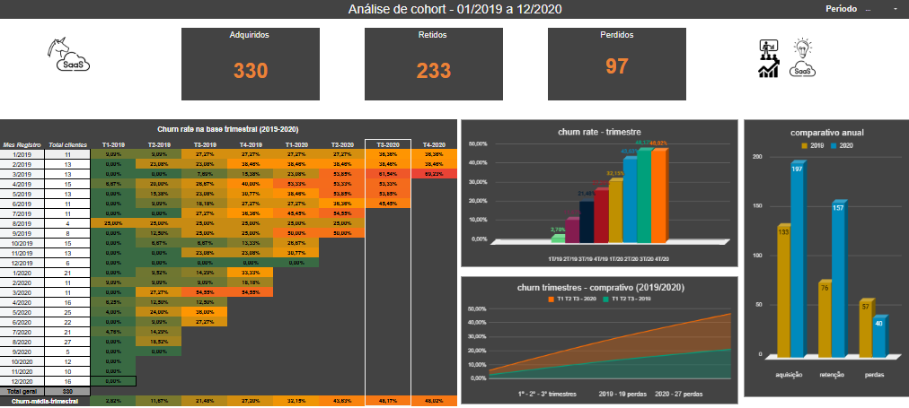
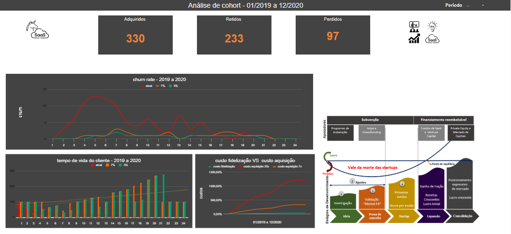
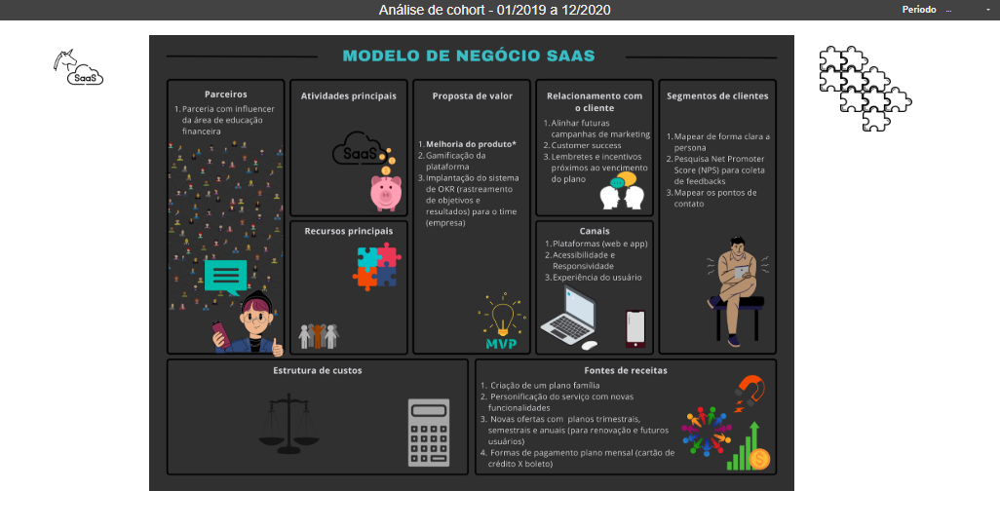

# data-saas-cohort-analysis
Análise estratégica de retenção e cohort para tomada de decisão em modelos SaaS. Programa Laboratória com apoio IBM.

## Análise de Cohort & Retenção SaaS (Startup)

## 📍 Índice de Navegação

1. [O Projeto](#o-projeto)
2. [Situação Problema](#situacao-problema)
3. [Metodologia e Ciclo de Desenvolvimento](#metodologia)
4. [Requisitos Técnicos](#requisitos-tecnicos)
5. [Stack Tecnológica](#stack-tecnologica)
6. [Entregáveis](#entregaveis)
7. [Principais Insights e Decisão de Negócio](#insights)
8. [Vídeo de Apresentação](#video)
9. [Acesso à Planilha Interativa](#google-sheets)

---

##  O Projeto
Desenvolvimento de uma ferramenta de **Business Intelligence** para monitoramento de saúde financeira e análise de retenção (Cohort) de uma Startup no modelo SaaS (Software as a Service).

##  Situação Problema
O projeto simula um cenário real de planejamento estratégico. O impasse surge na definição do orçamento anual: o setor de **Marketing** propõe triplicar o investimento em aquisição, enquanto a diretoria de **UX** alerta para o aumento nos cancelamentos.

O desafio central é realizar uma **Análise de Cohort** para determinar se a empresa atingiu o **Product-Market Fit (PMF)**, fornecendo embasamento para decidir entre expansão agressiva ou aprimoramento do produto.

##  Metodologia e Ciclo de Desenvolvimento
O projeto foi executado sob uma estrutura de **Sprint Intensiva**, simulando o ritmo de entrega de uma consultoria de dados:

* **Ciclo de Entrega:** Desenvolvido em 6 dias, abrangendo higienização, modelagem e análise estatística.
* **Abordagem Data-Driven:** Foco na extração de *Insights Acionáveis* para nível de diretoria (C-Level).
* **Validação de Mercado:** Avaliado por especialistas da **IBM e Laboratória**, recebendo pontuação máxima.

##  Requisitos Técnicos
* **Processamento de Dados:** Limpeza e formatação de grandes datasets.
* **Manipulação Avançada:** Uso de Tabelas Dinâmicas e `VLOOKUP` para integração de fontes.
* **Consultas Estruturadas:** Aplicação de fórmulas `QUERY` para filtragem dinâmica.
* **Lógica de Negócio:** Criação de matrizes de Cohort para identificação de mapas de calor.

##  Stack Tecnológica

### **Hard Skills**
* **Google Sheets:** Modelagem e dashboards.
* **Fórmulas:** `QUERY`, `VLOOKUP`, `ARRAYFORMULA`.
* **Visualização:** Heatmaps de retenção e gráficos de tendência.

### **Business Skills**
* **Métricas SaaS:** LTV (Lifetime Value), CAC, Churn Rate.
* **Estratégia:** Validação de PMF e Gestão do "Vale da Morte".
* **Agile:** Desenvolvimento em Sprints focadas em valor.

##  Entregáveis
1.  **Dashboard de Métricas SaaS:** Planilha interativa com taxas de retenção e períodos críticos de perda.
2.  **Apresentação Executiva:** Simulação de reunião estratégica com recomendações de investimento.
    * **Ferramenta:** Google Sheets
    * **Dataset:** [Kaggle - Retenção Startup](https://www.kaggle.com/datasets/datacertlaboratoria/projeto-2-reteno-de-startup-tecnolgica)

##  Análise, Insights e Decisão de Negócio

# 📊 Análise de Cohort — Dashboard de Retenção e Churn (SaaS)

Esta seção apresenta os principais painéis desenvolvidos para análise do comportamento de clientes ao longo do tempo, com foco em **retenção, churn e sustentabilidade do crescimento** em um modelo de negócio SaaS.

O objetivo da análise foi avaliar se a empresa atingiu **Product-Market Fit (PMF)** ou se deveria priorizar melhorias no produto antes de ampliar investimentos em aquisição.

---

# 📈 Visão Geral das Métricas de Aquisição, Retenção e Churn

A primeira tela do dashboard apresenta um panorama consolidado da base de clientes ao longo do período analisado (**1º trimestre de 2019 até o 4º trimestre de 2020**).

---

## Principais Indicadores

Três indicadores estratégicos sintetizam o comportamento da base de clientes:

| Indicador | Valor |
|---|---|
| Clientes adquiridos | **330** |
| Clientes retidos | **233** |
| Clientes perdidos (churn) | **97** |

Esses indicadores permitem compreender rapidamente o **equilíbrio entre crescimento e retenção**, um dos fatores críticos para modelos SaaS.

---

## Heatmap de Churn por Cohort

O mapa de calor apresenta a evolução da taxa de churn ao longo dos trimestres, permitindo identificar padrões de evasão de clientes conforme o tempo de permanência na base.

### Principais observações

- **Menor churn registrado:**  
  **2,82% no 1º trimestre de 2019**

- **Maior churn registrado:**  
  **48,17% no 3º trimestre de 2020**

O padrão observado indica que **as coortes mais recentes apresentaram maior evasão**, sugerindo possíveis problemas de retenção ou desalinhamento entre expectativa do cliente e entrega do produto.

---

## Evolução Trimestral do Churn

Os gráficos complementares mostram:

- evolução do churn **trimestre a trimestre**
- comparação entre **2019 e 2020**

O comportamento revela um **aumento significativo na taxa de churn durante 2020**, indicando deterioração da retenção ao longo do tempo.

Esse tipo de análise é essencial para avaliar a **saúde de crescimento de empresas SaaS**, pois crescimento baseado apenas em aquisição pode mascarar problemas estruturais no produto.

---

## Comparativo Anual de Aquisição, Retenção e Perdas

O gráfico de barras apresenta uma comparação direta entre os dois anos analisados, destacando:

- volume de **novos clientes adquiridos**
- clientes **retidos**
- clientes **perdidos**

Essa visão permite avaliar se o crescimento observado está sendo sustentado por retenção ou apenas por aquisição de novos usuários.

---

# 📉 Evolução do Churn e Sustentabilidade do Crescimento

A segunda tela aprofunda a análise da sustentabilidade do modelo de crescimento da empresa.

---

## Evolução Histórica do Churn

O primeiro gráfico apresenta a evolução da taxa de churn ao longo dos dois anos analisados.

A visualização permite identificar:

- momentos de **aceleração de cancelamentos**
- possíveis períodos de instabilidade do produto
- tendências de comportamento da base de clientes

Esse tipo de análise é fundamental para identificar **pontos críticos de retenção ao longo do ciclo de vida do cliente**.

---

## Tempo de Vida do Cliente (Customer Lifetime)

O gráfico de barras apresenta a evolução do **tempo de permanência médio dos clientes na plataforma**, medido mês a mês.

Esse indicador é particularmente importante em modelos SaaS porque está diretamente relacionado ao **Customer Lifetime Value (LTV)**.

Clientes com maior tempo de permanência tendem a gerar maior valor ao longo do relacionamento.

---

## Comparativo entre Custo de Aquisição e Custo de Retenção

Um dos indicadores mais relevantes apresentados no painel é o comparativo entre:

- **Custo de aquisição de clientes (CAC)**
- **Custo de fidelização / retenção**

A análise evidencia que **o custo de aquisição chega a ser até 7 vezes maior que o custo de retenção**.

> Reter clientes existentes costuma ser significativamente mais eficiente e econômico do que adquirir novos clientes.

---

## O Vale da Morte das Startups

O painel também apresenta uma ilustração conceitual do **Vale da Morte das Startups**, uma fase crítica no ciclo de vida de empresas inovadoras.

Esse conceito descreve o período em que:

- a empresa ainda não atingiu escala
- os custos operacionais continuam elevados
- a receita recorrente ainda não é suficiente para sustentar o crescimento

Nesse estágio, empresas que priorizam **aquisição agressiva sem garantir retenção** podem acelerar o consumo de capital e aumentar o risco de fracasso.

A análise realizada sugere que a empresa analisada pode estar **próxima dessa zona de risco**, reforçando a necessidade de priorizar estratégias de retenção antes de expandir investimentos em marketing.

---

# 🧭 Recomendações Estratégicas e Estrutura do Modelo de Negócio

A terceira tela apresenta uma estrutura estratégica com recomendações baseadas nos resultados da análise.

O objetivo dessa visualização é conectar os **dados analíticos aos direcionamentos estratégicos do negócio**.

---

## Estrutura Estratégica do Negócio

A estrutura apresentada aborda elementos fundamentais do modelo de negócio, incluindo:

- parcerias estratégicas
- atividades principais
- proposta de valor
- relacionamento com clientes
- canais de distribuição
- segmentos de clientes
- estrutura de custos
- fontes de receita

Essa abordagem permite alinhar as decisões analíticas com **ações concretas de gestão e crescimento da empresa**.

---

## Recomendações Estratégicas

Com base na análise de cohort e nos indicadores de churn e retenção, a recomendação estratégica foi **pivotar o foco de crescimento**.

### Direcionamento proposto

Priorizar **melhoria do produto e retenção de clientes** antes de ampliar investimentos em aquisição.

---

### Ações sugeridas

#### 1️⃣ Suspender expansão agressiva de marketing

Evitar a triplicação do investimento em aquisição enquanto os indicadores de retenção ainda demonstram fragilidade.

---

#### 2️⃣ Implementar estratégia de Customer Success

Estruturar uma área dedicada à retenção de clientes, com foco em:

- acompanhamento da jornada do usuário
- redução de churn involuntário
- aumento do engajamento com a plataforma

---

#### 3️⃣ Implementar gestão por OKRs

Adotar objetivos e resultados-chave para alinhar:

- times de produto
- marketing
- experiência do usuário

em torno de metas claras de **retenção e valor entregue ao cliente**.

---

#### 4️⃣ Desenvolver parcerias estratégicas segmentadas

Estabelecer parcerias com influenciadores e especialistas em educação financeira, ampliando o alcance do produto de forma mais qualificada.

---

> **Status de Diagnóstico: Crítico**

* **Ausência de PMF:** Churn com picos de **48,17%**, muito acima do padrão saudável de mercado (5% a 7%).
* **Eficiência de Capital:** CAC de 7 a 25 vezes mais caro que a retenção. Escalar o marketing agora seria "queimar caixa".
* **Vale da Morte:** Crescimento acelerado de perda de clientes apesar do aumento da base.

---

# 🎯 Decisão Estratégica do Projeto

Com base nas evidências apresentadas pela análise de cohort, a recomendação final foi:

## Pivotar e Priorizar o Produto

Em vez de acelerar a aquisição de clientes, a empresa deve primeiro:

- melhorar a experiência do produto
- aumentar retenção
- consolidar Product-Market Fit

Somente após estabilizar esses indicadores será estratégico retomar uma **estratégia de expansão agressiva de marketing**.

##  📺 Vídeo de Apresentação
* [Assistir Apresentação no YouTube](https://youtu.be/xAkzQkRXuxA)

##  📊 Acesso à Planilha Interativa
* [Abrir Dashboard no Google Sheets](https://docs.google.com/spreadsheets/d/12_zVD4tlEBGZmy07IeJx4pj9vVgNpzaea5O7GzkX_Ks/edit?usp=sharing)
